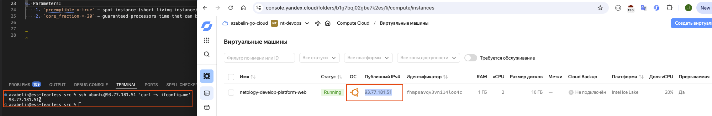

# Lesson 02 - Terraform intermediate

## Task 01

1. Done
2. Script:

    ```sh
    yc resource-manager cloud list
    yc resource-manager folder list
    yc iam service-account create --name nt-devops
    yc iam service-account list
    yc iam key create --service-account-name nt-devops --output sa-key-nt-devops.json
    yc iam key list --service-account-name nt-devops
    yc resource-manager folder add-access-binding --name nt-devops --role editor --service-account-name nt-devops
    yc resource-manager folder list-access-bindings --name nt-devops
    ```

3. Done
4. Found errors: unsupported by cloud VM parameters (cpu/ram/platform) + typos
5. Screenshot:

    

6. Parameters:
    1. `preemptible = true` - spot instance (short living instance), can be used to reduce costs
    2. `core_fraction = 20` - guaranteed processors time that can be used by VM on a shared Hypervisor, can be used to reduce costs

## Task 02

1. Done
2. Done
3. Script:

    ```sh
    azabelin@ess-fearless src % tf plan
    yandex_vpc_network.develop: Refreshing state... [id=enpk6fp7odtgs86ub6gp]
    data.yandex_compute_image.ubuntu: Reading...
    data.yandex_compute_image.ubuntu: Read complete after 2s [id=fd8ip9cb82gipfur34fq]
    yandex_vpc_subnet.develop: Refreshing state... [id=e9bsc847b3tv20kpkaqa]
    yandex_compute_instance.platform: Refreshing state... [id=fhmpeavqv3vni14loo4c]

    No changes. Your infrastructure matches the configuration.

    Terraform has compared your real infrastructure against your configuration and found no differences, so no changes are needed.
    ```

## Task 03

1. Done
2. Done
3. Script:

    ```sh
    azabelin@ess-fearless src % tf show | grep -E "resource\s"
    resource "yandex_compute_instance" "platform" {
    resource "yandex_compute_instance" "platform-db" {
    resource "yandex_vpc_network" "develop" {
    resource "yandex_vpc_subnet" "develop" {
    resource "yandex_vpc_subnet" "develop_db" {
    azabelin@ess-fearless src %
    ```

## Task 04

1. Done
2. Script:

    ```sh
    azabelin@ess-fearless src % tf apply -auto-approve
    data.yandex_compute_image.ubuntu: Reading...
    yandex_vpc_network.develop: Refreshing state... [id=enpk6fp7odtgs86ub6gp]
    data.yandex_compute_image.ubuntu: Read complete after 2s [id=fd8ip9cb82gipfur34fq]
    yandex_vpc_subnet.develop: Refreshing state... [id=e9bsc847b3tv20kpkaqa]
    yandex_vpc_subnet.develop_db: Refreshing state... [id=e2l310p2amoau5jkml8b]
    yandex_compute_instance.platform: Refreshing state... [id=fhmpeavqv3vni14loo4c]
    yandex_compute_instance.platform-db: Refreshing state... [id=epdegin32d6usl378fmi]

    Changes to Outputs:
    + inventory = {
        + vm_db  = {
            + external_ip   = "84.201.165.2"
            + fqdn          = "epdegin32d6usl378fmi.auto.internal"
            + instance_name = "netology-develop-platform-db"
            }
        + vm_web = {
            + external_ip   = "93.77.181.51"
            + fqdn          = "fhmpeavqv3vni14loo4c.auto.internal"
            + instance_name = "netology-develop-platform-web"
            }
        }

    You can apply this plan to save these new output values to the Terraform state, without changing any real infrastructure.


    Apply complete! Resources: 0 added, 0 changed, 0 destroyed.

    Outputs:

    inventory = {
        "vm_db" = {
            "external_ip" = "84.201.165.2"
            "fqdn" = "epdegin32d6usl378fmi.auto.internal"
            "instance_name" = "netology-develop-platform-db"
        }
        "vm_web" = {
            "external_ip" = "93.77.181.51"
            "fqdn" = "fhmpeavqv3vni14loo4c.auto.internal"
            "instance_name" = "netology-develop-platform-web"
        }
    }
    ```

## Task 05

1. Done
2. Script:

    ```sh
    azabelin@ess-fearless src % cat locals.tf 
    locals {
        name_prefix = "my-prefix"
        vm_web_instance_name = "${local.name_prefix}-${var.vm_web_instance_name}"
        vm_db_instance_name  = "${local.name_prefix}-${var.vm_db_instance_name}"
    }
    azabelin@ess-fearless src % cat main.tf | grep -i 'name'
    name = var.vpc_name
    name           = var.vpc_name
    name = local.vm_web_instance_name
    name           = var.vm_db_subnet_name
    name = local.vm_db_instance_name
    azabelin@ess-fearless src % 
    ```

3. Script:

    ```sh
    azabelin@ess-fearless src % tf apply -auto-approve
    data.yandex_compute_image.ubuntu: Reading...
    yandex_vpc_network.develop: Refreshing state... [id=enpk6fp7odtgs86ub6gp]
    data.yandex_compute_image.ubuntu: Read complete after 2s [id=fd8ip9cb82gipfur34fq]
    yandex_vpc_subnet.develop_db: Refreshing state... [id=e2l310p2amoau5jkml8b]
    yandex_vpc_subnet.develop: Refreshing state... [id=e9bsc847b3tv20kpkaqa]
    yandex_compute_instance.platform: Refreshing state... [id=fhmpeavqv3vni14loo4c]
    yandex_compute_instance.platform-db: Refreshing state... [id=epdegin32d6usl378fmi]

    Terraform used the selected providers to generate the following execution plan. Resource actions are indicated with the following symbols:
    ~ update in-place

    Terraform will perform the following actions:

    # yandex_compute_instance.platform will be updated in-place
    ~ resource "yandex_compute_instance" "platform" {
            id                        = "fhmpeavqv3vni14loo4c"
        ~ name                      = "netology-develop-platform-web" -> "my-prefix-netology-develop-platform-web"
            # (15 unchanged attributes hidden)

            # (6 unchanged blocks hidden)
        }

    # yandex_compute_instance.platform-db will be updated in-place
    ~ resource "yandex_compute_instance" "platform-db" {
            id                        = "epdegin32d6usl378fmi"
        ~ name                      = "netology-develop-platform-db" -> "my-prefix-netology-develop-platform-db"
            # (15 unchanged attributes hidden)

            # (6 unchanged blocks hidden)
        }

    Plan: 0 to add, 2 to change, 0 to destroy.

    Changes to Outputs:
    ~ inventory = {
        ~ vm_db  = {
            ~ instance_name = "netology-develop-platform-db" -> "my-prefix-netology-develop-platform-db"
                # (2 unchanged attributes hidden)
            }
        ~ vm_web = {
            ~ instance_name = "netology-develop-platform-web" -> "my-prefix-netology-develop-platform-web"
                # (2 unchanged attributes hidden)
            }
        }
    yandex_compute_instance.platform-db: Modifying... [id=epdegin32d6usl378fmi]
    yandex_compute_instance.platform: Modifying... [id=fhmpeavqv3vni14loo4c]
    yandex_compute_instance.platform: Modifications complete after 6s [id=fhmpeavqv3vni14loo4c]
    yandex_compute_instance.platform-db: Modifications complete after 10s [id=epdegin32d6usl378fmi]

    Apply complete! Resources: 0 added, 2 changed, 0 destroyed.

    Outputs:

    inventory = {
        "vm_db" = {
            "external_ip" = "84.201.165.2"
            "fqdn" = "epdegin32d6usl378fmi.auto.internal"
            "instance_name" = "my-prefix-netology-develop-platform-db"
        }
        "vm_web" = {
            "external_ip" = "93.77.181.51"
            "fqdn" = "fhmpeavqv3vni14loo4c.auto.internal"
            "instance_name" = "my-prefix-netology-develop-platform-web"
        }
    }
    ```

## Task 06

1. Done
2. Done
3. Script:

    ```sh
    azabelin@ess-fearless src % tf plan
    data.yandex_compute_image.ubuntu: Reading...
    yandex_vpc_network.develop: Refreshing state... [id=enpk6fp7odtgs86ub6gp]
    data.yandex_compute_image.ubuntu: Read complete after 2s [id=fd8ip9cb82gipfur34fq]
    yandex_vpc_subnet.develop: Refreshing state... [id=e9bsc847b3tv20kpkaqa]
    yandex_vpc_subnet.develop_db: Refreshing state... [id=e2l310p2amoau5jkml8b]
    yandex_compute_instance.platform-db: Refreshing state... [id=epdegin32d6usl378fmi]
    yandex_compute_instance.platform: Refreshing state... [id=fhmpeavqv3vni14loo4c]

    No changes. Your infrastructure matches the configuration.
    ```

## Task 07

1. `local.test_list[1]` = staging
2. `length(local.test_list[1])` = 7
3. `local.test_map["admin"]` = John
4. `"${local.test_map.admin} is admin for ${local.test_list[2]} server based on OS ${local.servers.production.image} with ${local.servers.production.cpu} vcpu, ${local.servers.production.ram} ram and ${length(local.servers.production.disks)} virtual disks"` = "John is admin for production server based on OS ubuntu-20-04 with 10 vcpu, 40 ram and 4 virtual disks"

## Task 07

1. `local.test[0].dev1[0]` = "ssh -o 'StrictHostKeyChecking=no' ubuntu@62.84.124.117"

## Notes

```sh
azabelin@ess-fearless src % cat terraform.tfvars | grep -vE "cloud|folder|root_key"
default_zone        = "ru-central1-a"
vpc_name            = "net-devops-02"
vms_resources       = {
    web = {
        cores = 2
        memory = 1
        core_fraction = 20
        disk_size = 10
        disk_type = "network-hdd"
    }

    db = {
        cores = 2
        memory = 2
        core_fraction = 20
        disk_size = 10
        disk_type = "network-hdd"
    }
}
```
