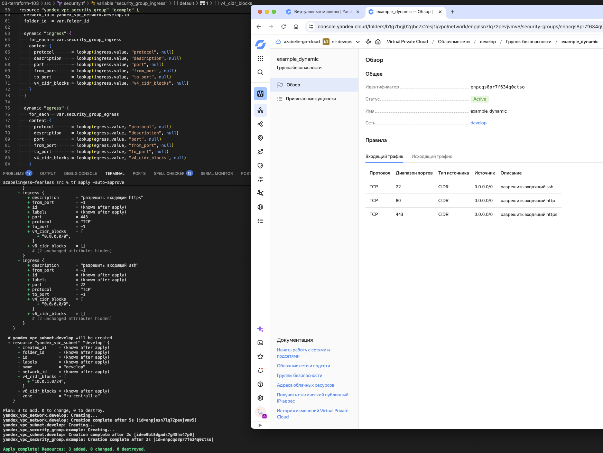
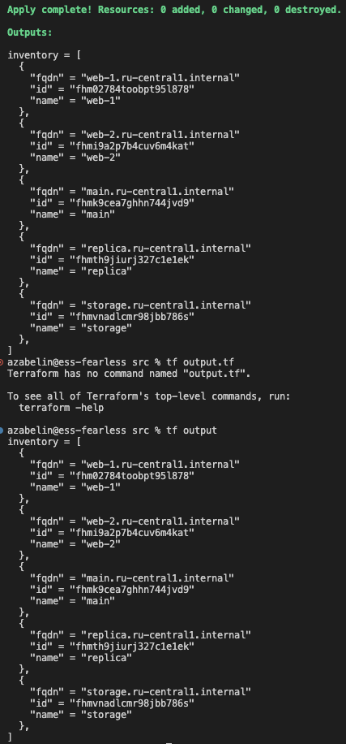

# Lesson 03 - Terraform advanced

## Task 01

1. Done
2. Screenshot:

    

## Task 02

1. Code:

    ```hcl
    resource "yandex_compute_instance" "count_vm" {
    count = 2

    name     = "web-${count.index + 1}"
    hostname = "web-${count.index + 1}"

    metadata = local.vms_metadata

    platform_id = local.platform_id
    scheduling_policy {
        preemptible = true
    }

    resources {
        cores         = 2
        memory        = 1
        core_fraction = 20
    }

    boot_disk {
        initialize_params {
        image_id = data.yandex_compute_image.ubuntu.image_id
        size     = 10
        type     = local.vms_disk_type
        }
    }

    network_interface {
        nat       = true
        subnet_id = yandex_vpc_subnet.develop.id
        security_group_ids = [
        yandex_vpc_security_group.example.id
        ]
    }
    }
    ```

2. Code:

    ```hcl
    resource "yandex_compute_instance" "for_each_vm" {
        for_each = { for vm in var.each_vm: vm.vm_name => vm }

        name = each.value.vm_name
        hostname = each.value.vm_name

        metadata = local.vms_metadata

        platform_id = local.platform_id
        scheduling_policy {
        preemptible = true
        }

        resources {
        cores = each.value.cpu
        memory = each.value.ram
        core_fraction = 20
        }

        boot_disk {
        initialize_params {
            image_id = data.yandex_compute_image.ubuntu.image_id
            size = each.value.disk_volume
            type = local.vms_disk_type
        }
        }

        network_interface {
        nat = true
        subnet_id = yandex_vpc_subnet.develop.id
        }
    }
    ```

## Task03

1. Code:

    ```hcl
    resource "yandex_compute_disk" "storage" {
        count = 3

        name = "storage-${count.index}"
        size = 1
        type = local.vms_disk_type
    }
    ```

2. Code:

    ```hcl
    resource "yandex_compute_instance" "storage" {
    name     = local.vm_storage_name
    hostname = local.vm_storage_name

    metadata = local.vms_metadata

    platform_id = local.platform_id
    scheduling_policy {
        preemptible = true
    }

    resources {
        cores         = 2
        memory        = 2
        core_fraction = 20
    }

    boot_disk {
        initialize_params {
        image_id = data.yandex_compute_image.ubuntu.image_id
        size     = 10
        type     = local.vms_disk_type
        }
    }

    dynamic "secondary_disk" {
        for_each = yandex_compute_disk.storage
        content {
        disk_id = secondary_disk.value.id
        }
    }

    network_interface {
        nat       = true
        subnet_id = yandex_vpc_subnet.develop.id
        security_group_ids = [
        yandex_vpc_security_group.example.id
        ]
    }
    }
    ```

## Task 04

1. Done
2. Done
3. Script:

    ```sh
    local_file.inventory: Creating...
    local_file.inventory: Creation complete after 0s [id=bdf72b7929696b20536991fa3619d8d2bc119221]

    Apply complete! Resources: 1 added, 0 changed, 0 destroyed.
    azabelin@ess-fearless src % cat inventory.ini 
    [webservers]

    web-1 ansible_host=51.250.74.10 fqdn=web-1.ru-central1.internal

    web-2 ansible_host=130.193.39.208 fqdn=web-2.ru-central1.internal


    [databases]

    main ansible_host=89.169.128.161 fqdn=main.ru-central1.internal

    replica ansible_host=93.77.178.68 fqdn=replica.ru-central1.internal


    [storage]

    storage ansible_host=93.77.181.243 fqdn=storage.ru-central1.internal


    azabelin@ess-fearless src % ssh ubuntu@$(grep 'web-1' inventory.ini | grep -oE '(\d{1,3}\.){3}\d{1,3}') 'curl -s ifconfig.me'
    51.250.74.10

    ```

## Task 05

1. Screenshot:

    

## Task 09

1. Script:

    ```sh
    > [for i in range(1, 10): format("rc%02d", i)]
    [
    "rc01",
    "rc02",
    "rc03",
    "rc04",
    "rc05",
    "rc06",
    "rc07",
    "rc08",
    "rc09",
    ]
    >  
    ```

2. Script:

    ```sh
    > [for i in range(1, 100): format("rc%02d", i) if i == 19 || !contains([0, 7, 8, 9], i % 10)]
    [
    "rc01",
    "rc02",
    "rc03",
    "rc04",
    "rc05",
    "rc06",
    "rc11",
    "rc12",
    "rc13",
    "rc14",
    "rc15",
    "rc16",
    "rc19",
    "rc21",
    "rc22",
    "rc23",
    "rc24",
    "rc25",
    "rc26",
    "rc31",
    "rc32",
    "rc33",
    "rc34",
    "rc35",
    "rc36",
    "rc41",
    "rc42",
    "rc43",
    "rc44",
    "rc45",
    "rc46",
    "rc51",
    "rc52",
    "rc53",
    "rc54",
    "rc55",
    "rc56",
    "rc61",
    "rc62",
    "rc63",
    "rc64",
    "rc65",
    "rc66",
    "rc71",
    "rc72",
    "rc73",
    "rc74",
    "rc75",
    "rc76",
    "rc81",
    "rc82",
    "rc83",
    "rc84",
    "rc85",
    "rc86",
    "rc91",
    "rc92",
    "rc93",
    "rc94",
    "rc95",
    "rc96",
    ]
    ```

## Notes

```sh
azabelin@ess-fearless src % cat terraform.tfvars | grep -vE "cloud|folder|root_key|token"

each_vm = [
  {
    vm_name     = "main"
    cpu         = 2
    ram         = 1
    disk_volume = 10
  },
  {
    vm_name     = "replica"
    cpu         = 2
    ram         = 1
    disk_volume = 10
  }
]
```