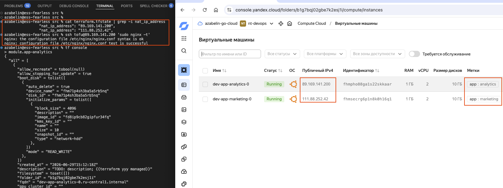
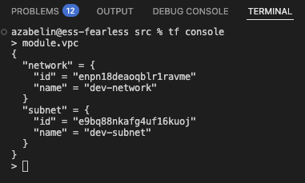
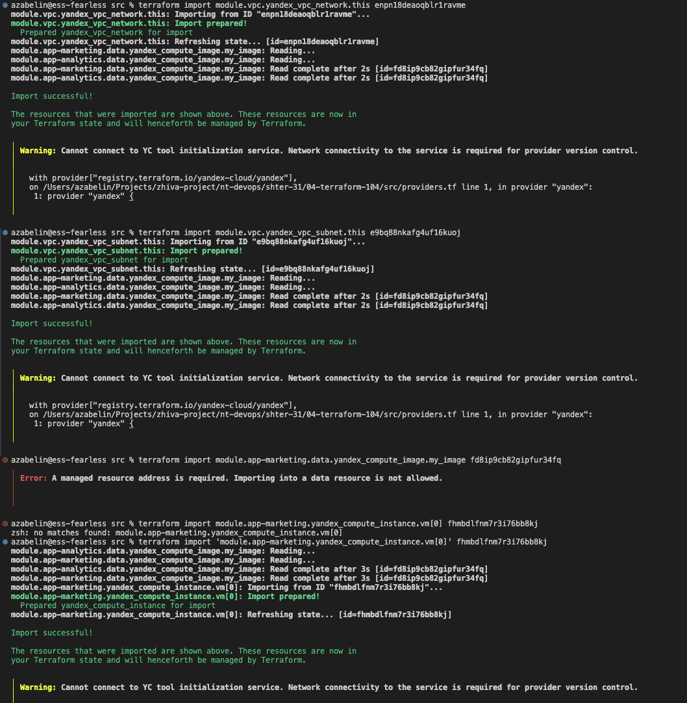
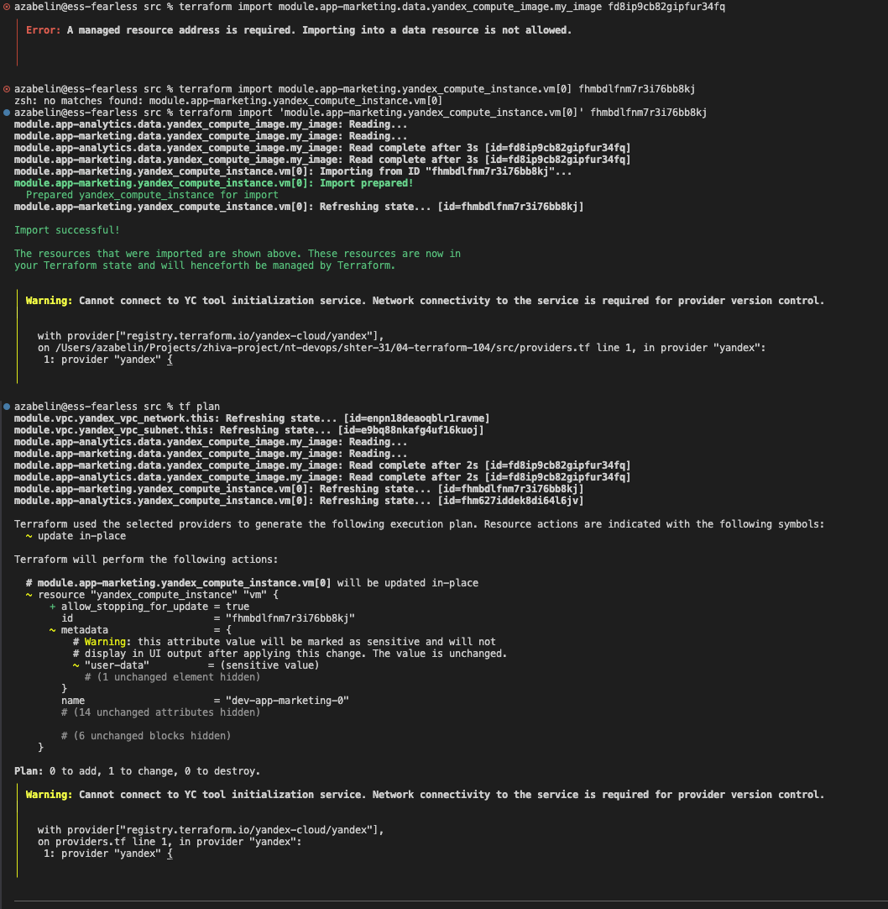
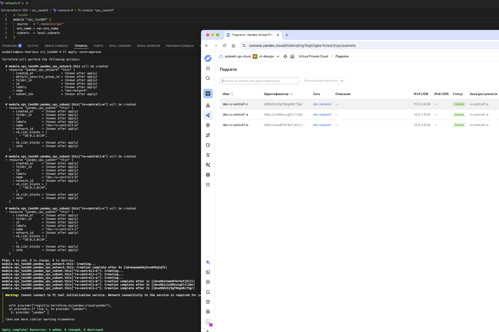
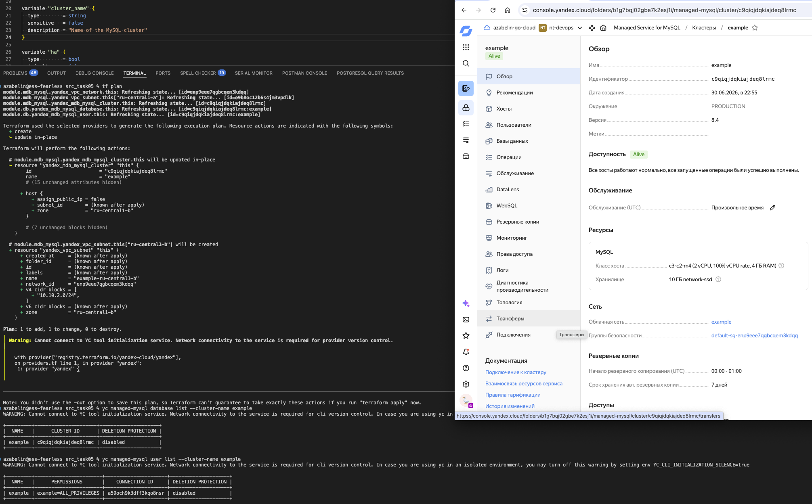

# Lesson 04 - Terraform advanced

## Task 01

1. Done
2. Code:

    ```yaml
    #cloud-config
    datasource:
    Ec2:
        strict_id: false
    ssh_pwauth: no

    users:
    - name: ${admin_ssh_login}
        sudo: ALL=(ALL) NOPASSWD:ALL
        shell: /bin/bash
        ssh_authorized_keys:
        %{ for admin_ssh_public_key in admin_ssh_public_keys }
        - "${admin_ssh_public_key}"
        %{ endfor }

    package_update: true
    package_upgrade: false

    packages:
        %{ for os_package in os_packages }
        - "${os_package}"
        %{ endfor }
    ```

3. Screenshot:

    

## Task 02

1. Done. See `sr/modules/vpc`
2. Code:

    ```sh
    azabelin@ess-fearless src % cat network.tf 
    module "vpc" {
        source                = "${path.root}/modules/vpc"
        env_name              = var.env_name
        subnet_v4_cidr_blocks = local.default.network.subnet.v4_cidr_blocks
        zone                  = local.default.zone
    }

    azabelin@ess-fearless src % cat modules/vpc/variables.tf 
    variable "env_name" {
        type        = string
        sensitive   = false
        description = "Name of the environment (will be used as prefix for resources names)"
    }

    variable "subnet_v4_cidr_blocks" {
        type        = list(string)
        sensitive   = false
        description = "CIDR blocks for subnet"
    }

    variable "zone" {
        type        = string
        sensitive   = false
        description = "Availability zone"
    }
    ```

3. Screenshot:

    

4. Code:

    ```hcl
    module "app-marketing" {
        depends_on = [ module.vpc ]

        source       = "git::https://github.com/udjin10/yandex_compute_instance.git?ref=main"
        env_name     = var.env_name
        network_id   = module.vpc.network.id
        subnet_ids   = [module.vpc.subnet.id]
        subnet_zones = [local.default.zone]
        platform     = local.default.instance.platform_id
        preemptible  = true

        instance_name          = "app-marketing"
        instance_count         = 1
        instance_cores         = local.default.instance.resource.cores
        instance_memory        = local.default.instance.resource.memory
        instance_core_fraction = local.default.instance.resource.core_fraction
        boot_disk_size         = local.default.instance.resource.disk_size
        boot_disk_type         = local.default.instance.resource.disk_type

        image_family = local.default.instance.image_family
        public_ip    = true

        metadata = {
            serial-port-enable = 1
            user-data          = local.cloud_init_config
        }

        labels = {
            app = "marketing"
        }
    }

    module "app-analytics" {
        depends_on = [ module.vpc ]

        source       = "git::https://github.com/udjin10/yandex_compute_instance.git?ref=main"
        env_name     = var.env_name
        network_id   = module.vpc.network.id
        subnet_ids   = [module.vpc.subnet.id]
        subnet_zones = [local.default.zone]
        platform     = local.default.instance.platform_id
        preemptible  = true

        instance_name          = "app-analytics"
        instance_count         = 1
        instance_cores         = local.default.instance.resource.cores
        instance_memory        = local.default.instance.resource.memory
        instance_core_fraction = local.default.instance.resource.core_fraction
        boot_disk_size         = local.default.instance.resource.disk_size
        boot_disk_type         = local.default.instance.resource.disk_type

        image_family = local.default.instance.image_family
        public_ip    = true

        metadata = {
            serial-port-enable = 1
            user-data          = local.cloud_init_config
        }

        labels = {
            app = "analytics"
        }
    }
    ```

5. Script:

    ```sh
    azabelin@ess-fearless src % head modules/vpc/README.md 
    ## Requirements

    The following requirements are needed by this module:

    - <a name="requirement_terraform"></a> [terraform](#requirement\_terraform) (~> 1.15.0)

    ## Providers

    The following providers are used by this module:

    azabelin@ess-fearless src % 
    ```

## Task03

1. Script:

    ```sh
    azabelin@ess-fearless src % tf state list
    module.app-analytics.data.yandex_compute_image.my_image
    module.app-analytics.yandex_compute_instance.vm[0]
    module.app-marketing.data.yandex_compute_image.my_image
    module.app-marketing.yandex_compute_instance.vm[0]
    module.vpc.yandex_vpc_network.this
    module.vpc.yandex_vpc_subnet.this
    azabelin@ess-fearless src %
    ```

2. Script:

    ```sh
    azabelin@ess-fearless src % tf state rm module.vpc
    Removed module.vpc.yandex_vpc_network.this
    Removed module.vpc.yandex_vpc_subnet.this
    Successfully removed 2 resource instance(s).
    azabelin@ess-fearless src % tf state list
    module.app-analytics.data.yandex_compute_image.my_image
    module.app-analytics.yandex_compute_instance.vm[0]
    module.app-marketing.data.yandex_compute_image.my_image
    module.app-marketing.yandex_compute_instance.vm[0]
    azabelin@ess-fearless src % 
    ```

3. Script:

    ```sh
    azabelin@ess-fearless src % tf state rm module.app-marketing
    Removed module.app-marketing.data.yandex_compute_image.my_image
    Removed module.app-marketing.yandex_compute_instance.vm[0]
    Successfully removed 2 resource instance(s).
    azabelin@ess-fearless src % tf state list
    module.app-analytics.data.yandex_compute_image.my_image
    module.app-analytics.yandex_compute_instance.vm[0]
    azabelin@ess-fearless src % 
    ```

4. Screenshots (metadata shown as changed due to templatefile function - no real changes on instance):

    

    

## Task 04

1. Done. See in `src_task04/modules/vpc`
2. Screenshot:

    

## Task 05

1. Done. See `src_task05/modules/mdb_mysql`
2. Done. See `src_task05/modules/database`
3. Done.
4. Screenshot:

    

## Task 06

1. Code:

    ```hcl
    module "s3" {
       source = "git::https://github.com/terraform-yc-modules/terraform-yc-s3.git"

        bucket_name = var.bucket_name
        versioning = {
            enabled = false
        }

        max_size = var.bucket_size
    }
    ```

* This git module does not look simple or suitable for task - it requires configured provider `https://registry.terraform.io/providers/hashicorp/aws`
